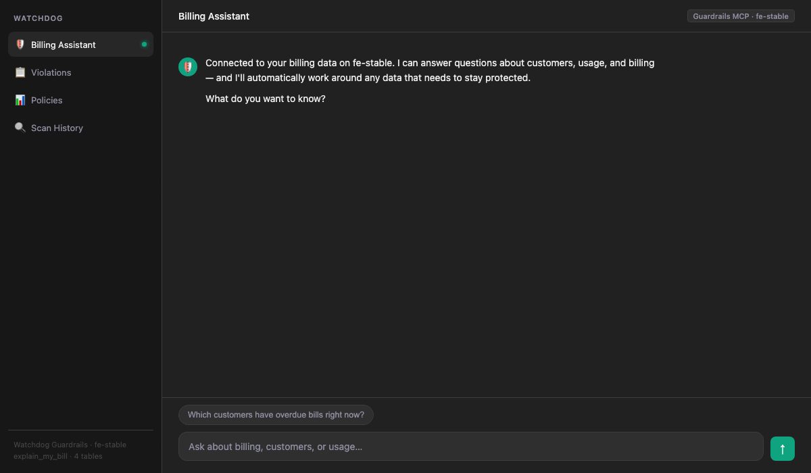

# Databricks Watchdog

**The platform enforces governance. Nobody measures it.**

ABAC masks columns. Tag policies reject bad values. DQ monitors flag anomalies. But ask your CDO: *"across all our policies — security, data quality, cost, AI agents — how compliant are we right now?"* Nobody can answer that.

Watchdog is the compliance posture layer for Unity Catalog. It crawls your estate, classifies resources through an ontology, evaluates declarative policies across every governance domain, tracks violations with owner accountability, and gives you a single compliance percentage that goes up or down over time.



---

## Why Watchdog Exists

### The question nobody can answer today

Your CDO asks: *"Across all our data — every table, every grant, every agent — how compliant are we right now? Who owns the gaps? Is it getting better or worse?"*

Today, the answer requires manually stitching together:
- **Tag Policies** — "are the right tags applied?" (Governance Hub)
- **ABAC rules** — "are columns masked?" (information_schema)
- **DQ Monitors** — "are quality checks running?" (Lakehouse Monitoring)
- **Grants** — "are permissions group-based?" (information_schema)
- **AI agents** — "are they governed? who's accessing PII?" (system.serving)

Each of these lives in a different UI, different system table, different team's responsibility. There is no single view across all of them. There is no concept of "this resource violates 3 policies across 2 governance domains." There is no owner accountability. There is no trend line.

### What the platform does vs. what's missing

The platform **enforces** governance at runtime — ABAC masks a column, a tag policy rejects an invalid value, a row filter hides rows. This is the immune system. It works.

But enforcement is not posture. Nobody measures:

| Question | Platform answer |
|---|---|
| What % of PII tables have a data steward? | **Can't answer** — requires cross-tag evaluation |
| Which owners have the most open violations? | **Can't answer** — no violation tracking per owner |
| Are we more compliant this month than last? | **Can't answer** — no trend data |
| If I add a "PII must have retention" policy, how many tables fail? | **Can't answer** — no simulation |
| Which AI agents are accessing sensitive data without governance metadata? | **Can't answer** — no agent compliance layer |
| One policy change should cascade to PII, HIPAA, and SOX assets — does it? | **Can't answer** — flat tags have no inheritance |

### What Watchdog adds

Watchdog is the **compliance posture layer** that sits on top of the platform's enforcement:

- **Cross-domain evaluation**: one scan measures security, data quality, cost, operations, and agent governance together
- **Composable rules**: `IF pii THEN must have steward AND retention` — logic the platform can't express
- **Ontology with inheritance**: one policy on `ConfidentialAsset` covers PII, HIPAA, SOX, and every child class
- **Violation lifecycle**: open → resolved → exception, with deduplication, first-detected dates, and trend tracking
- **Owner accountability**: every violation attributed to a person with remediation steps
- **AI agent governance**: crawls agents and execution traces, classifies managed vs customer endpoints, evaluates agent-specific policies, produces prioritized remediation
- **AI interface**: 13 MCP tools so Claude, Genie, and AI agents can query and act on governance posture
- **Compliance trends**: scan-over-scan deltas, direction indicators, rolling averages

```
  Violation Lifecycle
  ═══════════════════

  New failure               Still failing            No longer failing
  detected                  on next scan             on next scan
     │                          │                         │
     ▼                          ▼                         ▼
 ┌────────┐  last_detected  ┌────────┐  resolved_at  ┌──────────┐
 │  OPEN  │────────────────▶│  OPEN  │──────────────▶│ RESOLVED │
 └────────┘   updated       └────────┘               └──────────┘
     │                          │
     │  exception approved      │  exception approved
     ▼                          ▼
 ┌───────────┐             ┌───────────┐
 │ EXCEPTION │             │ EXCEPTION │
 │ (waiver)  │             │ (waiver)  │
 └───────────┘             └───────────┘
      │
      │ exception expires
      ▼
   ┌────────┐
   │  OPEN  │  (re-opened)
   └────────┘
```

### The analogy

The platform is the **immune system** — it blocks bad things at runtime.

Watchdog is the **annual physical** — it measures overall health, tracks trends, and tells you what to fix before symptoms appear.

For AI agents, Watchdog is also the **safety briefing** — it checks governance before agents access data and produces compliance reports after they finish.

---

## What You Get in 30 Minutes

Deploy Watchdog to a workspace and run one scan. Here's what comes back:

### Cross-Domain Compliance Posture

One view across security, data quality, cost, and operations:

| Domain | Resources | Critical | High | Medium |
|---|---|---|---|---|
| SecurityGovernance | 2,352 | 8 | 4,480 | 10 |
| CostGovernance | 2,374 | 0 | 40 | 2,431 |
| DataQuality | 2,134 | 0 | 3 | 3,492 |
| OperationalGovernance | 22 | 0 | 0 | 22 |

*The Governance Hub shows tag policies, ABAC rules, and DQ monitors separately. Nobody aggregates across all of them.*

### Owner Accountability

Every violation is attributed to a resource owner with remediation steps:

| Owner | Total | Critical | High | Policies Violated | Domains |
|---|---|---|---|---|---|
| stuart.gano@ | 358 | 1 | 96 | 20 | 4 |
| System user | 896 | 0 | 296 | 7 | 3 |
| eric.popowich@ | 870 | 0 | 268 | 7 | 3 |

*The platform has no concept of "violations per owner" or accountability tracking.*

### Ontology Classification with Inheritance

Resources are classified into a hierarchy. One policy on `ConfidentialAsset` automatically covers every child class:

```
                        DataAsset
                       /    |    \
              PiiAsset  InternalAsset  PublicAsset
             /       \
      PiiTable    HipaaAsset
                       |
                   PhiAsset

                      ComputeAsset
                     /      |      \
          ProductionJob  InteractiveCluster  DevelopmentCompute
                |
           CriticalJob

                      AgentAsset
                     /    |     \
    ManagedModelEndpoint  |  UngovernedAgent
                          |
              AgentWithPiiAccess
```

Change a policy at `ConfidentialAsset`? Every `PiiAsset`, `HipaaAsset`, and `PhiAsset` inherits it automatically. UC has flat tags — you'd edit every child policy individually.

*31 ontology classes across 8 base types. Add your own by dropping YAML in `engine/ontologies/`.*

### Actionable Remediation Lists

Watchdog caught 211 direct-user grants (POL-A002):

```
3f550a6e-...  has USE_SCHEMA  on schema  explain_my_bill
account users has SELECT      on table   property_listing_sample
```

An admin takes this list and migrates every grant to group-based access. The platform shows grants in `information_schema` but doesn't flag which ones violate your policies.

### Composable Rules the Platform Can't Express

| Rule | What It Checks | Platform Equivalent |
|---|---|---|
| IF `data_classification = pii` THEN must have BOTH `data_steward` AND `retention_days` | Cross-tag conditional | **None** |
| Grant grantee must match regex `^(group:\|account group:)` | Grant metadata evaluation | **None** |
| IF `environment = prod` THEN must have `on_call_team` AND `alert_channel` | Conditional tag requirement | **None** |

Tag Policies enforce "this tag must use these values." Watchdog rules express arbitrary logic across tags and metadata.

### AI Agent Runtime Governance

Watchdog crawls deployed AI agents (Apps + serving endpoints) and their execution traces from `system.serving.endpoint_usage`. Real results from fe-stable:

| What | Count |
|---|---|
| Agents discovered | 38 (5 Databricks Apps + 33 serving endpoints) |
| Agent execution traces | 500 (per-requester usage from last 7 days) |
| Ungoverned agents | 533 (no owner metadata → POL-AGENT-002 violation) |
| Top requester | 8.9M requests, 31B input tokens (flagged as high-volume) |

*The platform has no concept of AI agent governance. MLflow traces what agents did. Watchdog evaluates whether what they did complied with your policies.*

```
  Defense in Depth
  ════════════════

┌─────────────────────────────────────────────────────────────┐
│                    AI Agent Execution                         │
│                                                               │
│  ┌─ Layer 3: Runtime Guardrails (Watchdog) ──────────────┐   │
│  │  check_before_access() → DENY/WARN/ALLOW              │   │
│  │  log_agent_action() → structured audit trail           │   │
│  │  report_agent_execution() → compliance report          │   │
│  └────────────────────────────────────────────────────────┘   │
│                          │                                    │
│  ┌─ Layer 2: Build-Time Governance (Watchdog) ───────────┐   │
│  │  validate_ai_query() → blocked/warning/proceed         │   │
│  │  Classification × operation risk matrix                │   │
│  └────────────────────────────────────────────────────────┘   │
│                          │                                    │
│  ┌─ Layer 1: Platform Enforcement (Native) ──────────────┐   │
│  │  ABAC: column masks, row filters at query time         │   │
│  │  Tag Policies: reject invalid tag values               │   │
│  │  UC Grants: permission denied if no access             │   │
│  └────────────────────────────────────────────────────────┘   │
│                                                               │
│  ┌─ Layer 0: Posture Scanning (Watchdog) ────────────────┐   │
│  │  Daily scan → ontology classification → policy eval    │   │
│  │  Violation tracking → owner accountability → trends    │   │
│  └────────────────────────────────────────────────────────┘   │
└─────────────────────────────────────────────────────────────┘
```

#### Three layers of agent enforcement

```
              Agent Lifecycle
              ═══════════════

  ┌─────────────────────────────────────────────────┐
  │  LAYER 1: Posture Scanning (daily)              │
  │                                                  │
  │  Engine crawls agents + execution traces         │
  │  → Classifies: managed / customer / ungoverned   │
  │  → Evaluates 7 agent policies                    │
  │  → Produces violations + remediation priorities  │
  │                                                  │
  │  WHO USES IT: Platform admins, compliance team   │
  └──────────────────────┬──────────────────────────┘
                         │
  ┌──────────────────────▼──────────────────────────┐
  │  LAYER 2: Build-Time Governance (pre-deploy)    │
  │                                                  │
  │  Developer → validate_ai_query(tables, op)       │
  │           ← blocked / warning / proceed          │
  │                                                  │
  │  PII + train → BLOCKED                           │
  │  Export-controlled + extract → BLOCKED            │
  │  Confidential + sensitive cols → WARNING          │
  │                                                  │
  │  WHO USES IT: AI developers before shipping      │
  └──────────────────────┬──────────────────────────┘
                         │
  ┌──────────────────────▼──────────────────────────┐
  │  LAYER 3: Runtime Enforcement (during execution)│
  │                                                  │
  │  Agent → check_before_access(table)              │
  │       ← DENY / WARN / ALLOW + reasons            │
  │  Agent → log_agent_action(what I did)            │
  │  Agent → get_agent_compliance(how am I doing?)   │
  │  Agent → report_agent_execution(done)            │
  │       ← compliance report + recommendations      │
  │                                                  │
  │  WHO USES IT: Running agents, real-time          │
  └─────────────────────────────────────────────────┘
```

**Layer 1: Posture scanning (offline)** — The engine crawls all agents daily, classifies them (managed FMAPI endpoint vs customer agent, governed vs ungoverned), evaluates agent governance policies, and produces violations with remediation steps. Admins see which agents are ungoverned, which are accessing PII, and what to fix first.

**Layer 2: Build-time governance (pre-deployment)** — Before an AI developer ships an agent, `validate_ai_query` checks whether the tables the agent will use are safe for the intended operation. PII tables block training. Export-controlled tables block high-risk operations. Confidential tables with sensitive columns get warnings. Each check returns a verdict (proceed/warning/blocked) with alternatives.

**Layer 3: Runtime enforcement (during execution)** — While an agent runs, it calls the Guardrails MCP for real-time governance:

```
Agent starts task
  → check_before_access("my-agent", "catalog.schema.pii_table", "SELECT")
  ← DENY: "Table is classified as PII."
           "Suggest: catalog.schema.pii_table_masked"

  → check_before_access("my-agent", "catalog.schema.sales_data", "SELECT")
  ← ALLOW: classifications: ["DataAsset"], 0 violations

  → log_agent_action("my-agent", "data_access", "catalog.schema.sales_data")
  ← {status: "logged", event_id: "uuid-..."}

  → get_agent_compliance("my-agent")
  ← {checks_passed: 1, checks_denied: 1, risk_level: "high",
     pii_tables_accessed: ["catalog.schema.pii_table"]}

  → report_agent_execution("my-agent", "Generated sales report")
  ← {compliance_status: "non_compliant", risk_level: "high",
     recommendations: ["1 access denied — resolve before re-running",
                        "PII tables accessed — ensure data handling complies"]}
```

#### How `check_before_access` decides

| Condition | Decision | Action |
|---|---|---|
| Table has critical violations | **DENY** | Suggests contacting owner |
| Table classified as PII | **DENY** | Suggests `_masked` view alternative |
| Table classified as restricted/export-controlled | **DENY** | Suggests governance exception |
| Table has high-severity violations | **WARN** | Allows but logs warning |
| Confidential table + sensitive columns requested | **WARN** | Flags specific columns |
| No issues | **ALLOW** | Proceeds, logs access |

Every check updates the agent's session state. At the end, `report_agent_execution` produces a compliance report with a status (compliant/needs_review/non_compliant), risk level, and actionable recommendations.

#### Risk scoring

Agents get a composite risk tier based on two dimensions:

| | Low volume (<100K requests) | High volume (≥100K requests) |
|---|---|---|
| **No sensitivity flags** | low | medium |
| **Any sensitivity flag** (PII, external, export) | high | critical |

The Agent Risk page in the dashboard cross-references this with live `system.serving.endpoint_usage` data so you see real-time token consumption alongside Watchdog's compliance assessment.

#### Agent policies

| Policy | Severity | What it checks |
|---|---|---|
| POL-AGENT-001 | critical | PII-accessing agents must have audit logging |
| POL-AGENT-002 | high | All agents must have a designated owner |
| POL-AGENT-003 | critical | Data-exporting agents need documented approval |
| POL-AGENT-004 | high | External API agents must be registered |
| POL-AGENT-005 | critical | Ungoverned agents can't access production data |
| POL-AGENT-006 | high | Production agents must specify model endpoint |
| POL-AGENT-007 | medium | Production agents need error handling |

FMAPI endpoints (`databricks-*`) are auto-classified as `ManagedModelEndpoint` with `agent_owner=databricks` and `audit_logging_enabled=true` — they pass all policies by default since they're platform-managed infrastructure.

---

## Architecture

### Scan Pipeline

```
┌──────────┐    ┌───────────┐    ┌──────────┐    ┌──────────┐    ┌──────────┐
│  CRAWL   │───▶│ CLASSIFY  │───▶│ EVALUATE │───▶│  MERGE   │───▶│ NOTIFY   │
│          │    │           │    │          │    │          │    │          │
│ 16 types │    │ Ontology  │    │ 46       │    │ Dedup    │    │ Per-owner│
│ SDK +    │    │ 31 classes│    │ policies │    │ Lifecycle│    │ digests  │
│ system   │    │ Tag-based │    │ YAML +   │    │ open →   │    │ Email /  │
│ tables   │    │ hierarchy │    │ user     │    │ resolved │    │ webhook  │
└──────────┘    └───────────┘    └──────────┘    └──────────┘    └──────────┘
     │                │                │               │               │
     ▼                ▼                ▼               ▼               ▼
 resource_       resource_        scan_results    violations     notification_
 inventory    classifications    (append-only)    (MERGE +       queue
                                                  exceptions)
```

### Component Architecture

```
┌─────────────────────────────────────────────────────────────────┐
│  Watchdog Engine (Daily Scan Job)                                │
│                                                                  │
│  Crawl 16 resource types (data + compute + identity + agents)    │
│  → Classify via ontology (31 classes)                            │
│  → Evaluate 46 policies (data governance + agent governance)     │
│  → Track violations with lifecycle → Notify owners               │
└───────────┬───────────────────┬──────────────────┬──────────────┘
            │                   │                  │
    ┌───────▼───────┐  ┌───────▼────────┐  ┌──────▼──────────────┐
    │ Lakeview       │  │ Watchdog MCP   │  │ Guardrails MCP      │
    │ Dashboard      │  │ 13 AI tools    │  │ 13 tools:           │
    │ 10 pages       │  │ for assistants │  │  9 build-time +     │
    ├────────────────┤  ├────────────────┤  │  4 runtime agent    │
    │ Genie Space    │  │ Ontos Adapter  │  │  governance         │
    │ 19 tables      │  │ Business       │  │  check_before_access│
    │ NL governance  │  │ catalog views  │  │  log_agent_action   │
    └────────────────┘  └────────────────┘  └─────────────────────┘
```

**Delta tables are the contract.** Every consumer reads the same tables. No APIs between layers.

---

## Quickstart (30 minutes)

### Prerequisites

- Databricks workspace with **Unity Catalog** enabled
- **Databricks CLI** v0.230+ (`databricks --version`)
- A catalog where Watchdog can create a `watchdog` schema
- A SQL warehouse (Starter Warehouse works)

### Step 1: Clone and configure

```bash
git clone https://github.com/stuagano/databricks-watchdog.git
cd databricks-watchdog
```

Edit `engine/databricks.yml` — add a target for your workspace:

```yaml
targets:
  my-workspace:
    mode: development
    default: true
    workspace:
      host: https://your-workspace.cloud.databricks.com
      profile: your-profile
    variables:
      catalog: your_catalog
      schema: watchdog
```

### Step 2: Deploy the engine

```bash
cd engine
databricks bundle validate -t my-workspace
databricks bundle deploy -t my-workspace
```

### Step 3: Run your first scan

```bash
databricks bundle run watchdog_adhoc_scan -t my-workspace
```

This crawls all resources (tables, volumes, jobs, clusters, warehouses, grants, service principals, agents, agent execution traces), classifies them via the ontology (31 classes), evaluates 46 policies, and writes violations. Takes 2-3 minutes.

> **Multiple metastores?** The default scan covers the current workspace's metastore only. To scan several at once, see [Multi-metastore scanning](#multi-metastore-scanning) below — you'll set `WATCHDOG_METASTORE_IDS` and use the `crawl_all_metastores` entrypoint.

### Step 4: Check results

```sql
-- How many violations?
SELECT severity, COUNT(*) FROM your_catalog.watchdog.violations
WHERE status = 'open' GROUP BY severity;

-- Who owns the most?
SELECT owner, COUNT(*) as violations
FROM your_catalog.watchdog.violations
WHERE status = 'open' GROUP BY owner ORDER BY violations DESC LIMIT 10;

-- What's the compliance posture by domain?
SELECT * FROM your_catalog.watchdog.v_domain_compliance;
```

### Step 5: Run the demo notebook (recommended)

Import `engine/notebooks/governance_posture_demo.py` into your workspace. It walks through:

1. **What the Governance Hub shows** — UC asset inventory, tag coverage, privilege distribution (system tables)
2. **Where the gaps are** — cross-domain posture, cross-tag rules, violation tracking, owner accountability
3. **What Watchdog adds** — compliance posture by domain, ontology classification, owner violation detail, composable rules, remediation lists
4. **The unified view** — cross-join queries that combine Hub system tables with Watchdog data (who has access to violated resources, untagged tables with violations)

This is the best way to demonstrate the value to a customer or stakeholder.

### Step 6: Deploy the Lakeview dashboards (optional)

```bash
python engine/dashboards/lakeview/deploy_dashboard.py \
  --profile your-profile \
  --catalog your_catalog \
  --schema watchdog \
  --warehouse-id your_warehouse_id \
  --publish
```

Two dashboards available:
- **Watchdog Governance Posture** — standalone Watchdog compliance data (5 pages)
- **UC Governance Hub + Watchdog** — unified dashboard combining UC system tables with Watchdog compliance. Includes cross-join views: who has access to violated resources, untagged tables with violations.

### Step 7: Deploy the MCP server (optional)

Edit `mcp/databricks.yml` with your workspace target, then:

```bash
cd mcp
databricks bundle deploy -t my-workspace
databricks apps start watchdog-mcp-my-workspace --profile your-profile
# Wait for compute to be ACTIVE, then:
databricks apps deploy watchdog-mcp-my-workspace \
  --source-code-path /Workspace/Users/you@company.com/.bundle/watchdog-mcp/my-workspace/files \
  --profile your-profile
```

Connect from Claude Code: `https://<app-url>/mcp/sse`

### Step 8: Deploy the Genie Space (optional)

```bash
python mcp/genie/deploy_genie_space.py \
  --catalog your_catalog \
  --schema watchdog \
  --warehouse-id your_warehouse_id \
  --profile your-profile
```

Business users can ask: "Who has the most critical violations?" or "Which PII tables lack a data steward?"

### Step 9: Deploy AI guardrails (optional)

Edit `guardrails/databricks.yml` with your workspace target, then:

```bash
cd guardrails
databricks bundle deploy -t my-workspace
databricks apps start mcp-ai-guardrails-my-workspace --profile your-profile
# Wait for ACTIVE, then deploy code (same pattern as MCP server)
```

AI agents get build-time AND runtime governance:
- **Build-time**: "Is this table safe to use in my agent?" (`validate_table_usage`, `build_safely`)
- **Runtime**: "Check this table before I access it" (`check_before_access` — returns allow/deny/warn with reasons)
- **Audit**: "Log what my agent did" (`log_agent_action` — structured compliance audit trail)
- **Post-execution**: "How did my agent do?" (`report_agent_execution` — compliance report with risk level)

---

## Industry Policy Packs

```
┌──────────────────────────────────────────────────────┐
│  engine/ontologies/          engine/policies/          │
│  (base classes + rules)      (base policies)           │
│                                                        │
│  DataAsset, ComputeAsset     POL-S*, POL-Q*, POL-C*    │
│  PiiAsset, GrantAsset        POL-A*, POL-AGENT*        │
└───────────────────────┬──────────────────────────────┘
                        │ inherits + extends
        ┌───────────────┼───────────────┐
        ▼               ▼               ▼
┌──────────────┐ ┌──────────────┐ ┌──────────────┐
│  healthcare/ │ │  financial/  │ │  defense/    │
│              │ │              │ │              │
│ +PhiAsset    │ │ +PciAsset    │ │ +CuiAsset   │
│ +EphiAsset   │ │ +GlbaAsset   │ │ +ItarAsset  │
│ +HipaaAudit  │ │ +SoxAudit    │ │ +Cmmc2Asset │
│              │ │              │ │              │
│ 10 policies  │ │ 12 policies  │ │ 8 policies  │
│ POL-HIPAA-*  │ │ POL-SOX/PCI  │ │ POL-NIST-*  │
└──────────────┘ └──────────────┘ └──────────────┘
```

Drop-in YAML packs for regulated industries. Copy into `engine/ontologies/` and `engine/policies/`:

| Pack | Policies | Ontology Classes | Covers |
|---|---|---|---|
| `library/healthcare/` | 10 (POL-HIPAA-*) | 4 (PhiAsset, EphiAsset, HipaaAuditAsset, DeIdentifiedDataset) | HIPAA: PHI stewardship, encryption, access logging, retention, BAA, minimum necessary, breach notification |
| `library/financial/` | 12 (POL-SOX-*, POL-PCI-*, POL-GLBA-*) | 6 (FinancialReportingAsset, PciAsset, GlbaAsset, ...) | SOX audit trails, separation of duties. PCI encryption/masking. GLBA privacy notices. |
| `library/defense/` | 8 (POL-NIST-*, POL-CMMC-*, POL-ITAR-*) | 5 (CuiAsset, ItarAsset, CmmcLevel2Asset, ...) | NIST 800-171, CMMC Level 2, ITAR export control |
| `library/general/` | 10 (POL-GEN-*) | 5 (UntaggedAsset, StaleAsset, UndocumentedAsset, ...) | CIS-style benchmarks: classification, documentation, cost attribution, lifecycle, monitoring |

Each pack includes ontology classes, rule primitives, policies, and dashboard SQL queries.

---

## What's Deployed (Full Stack)

| Component | What | Deploy Command |
|---|---|---|
| **Engine** | Daily scan — 16 resource types (data + compute + identity + agents), 28 ontology classes, 46 policies | `cd engine && databricks bundle deploy` |
| **Lakeview Dashboard** | 10-page unified governance hub (data + agents + remediation) | `python engine/dashboards/lakeview/deploy_dashboard.py` |
| **Watchdog MCP** | 13 AI tools for compliance queries | `cd mcp && databricks bundle deploy` + app deploy |
| **Genie Space** | NL governance exploration (19 tables: Watchdog + UC system tables) | `python mcp/genie/deploy_genie_space.py` |
| **Guardrails MCP** | 13 tools: 9 build-time + 4 runtime agent governance | `cd guardrails && databricks bundle deploy` + app deploy |
| **Ontos Adapter** | Pluggable governance module for Ontos business catalog | Drop-in to Ontos fork |

---

## Data Model

```
┌──────────────┐  scan_id   ┌──────────────────┐  scan_id   ┌────────────────────┐
│ resource_    │────────────▶│  scan_results    │◀───────────│ resource_          │
│ inventory    │             │  (append-only)   │            │ classifications    │
│              │  resource_  │                  │            │                    │
│ 16 types     │───id───┐   │ pass/fail per    │            │ class_name +       │
│ tags + meta  │        │   │ (resource,policy)│            │ ancestors          │
│ metastore_id │        │   └──────────────────┘            └────────────────────┘
└──────────────┘        │
                        │   ┌──────────────────┐            ┌────────────────────┐
                        ├──▶│  violations      │◀───────────│  exceptions        │
                        │   │  (MERGE dedup)   │  override  │  (approved waivers)│
                        │   │                  │  status    │                    │
                        │   │  open/resolved/  │            │  approved_by +     │
                        │   │  exception       │            │  expires_at        │
                        │   └──────────────────┘            └────────────────────┘
                        │
                        │   ┌──────────────────┐            ┌────────────────────┐
                        └──▶│  notification_   │            │  scan_summary      │
                            │  queue           │            │  (trend tracking)  │
                            │                  │            │                    │
                            │  per-owner       │            │  compliance_pct +  │
                            │  digests         │            │  deltas            │
                            └──────────────────┘            └────────────────────┘

                            ┌──────────────────┐            ┌────────────────────┐
                            │  policies        │────────────│  policies_history  │
                            │  (YAML + user)   │  audit     │  (append-only)     │
                            └──────────────────┘            └────────────────────┘
```

### Tables

| Table | Purpose |
|---|---|
| `resource_inventory` | All discovered resources per scan (16 types incl. agents + traces, tags, metadata, metastore_id) |
| `resource_classifications` | Ontology class assignments (resource_id → class_name with ancestor chain) |
| `policies` | Policy definitions — YAML-synced + user-created (hybrid management) |
| `policies_history` | Append-only audit trail of policy changes |
| `scan_results` | Every (resource, policy) evaluation result per scan |
| `violations` | Open violations — deduplicated, with status lifecycle (open/resolved/exception) |
| `exceptions` | Approved policy exceptions with expiration dates |
| `notification_queue` | Per-owner notification digests (CDF-enabled) |
| `remediation_agents` | Registry of remediation agent definitions |
| `remediation_proposals` | Agent-generated fix proposals with review lifecycle |
| `remediation_applied` | Applied proposal audit trail with verification status |

### Compliance Views

| View | Purpose |
|---|---|
| `v_resource_compliance` | Per-resource violation counts by severity |
| `v_class_compliance` | Compliance % per ontology class |
| `v_domain_compliance` | Executive posture by governance domain |
| `v_tag_policy_coverage` | Tag policy satisfaction per resource |
| `v_data_classification_summary` | Classification coverage % by catalog |
| `v_dq_monitoring_coverage` | DQM/LHM monitoring status per table |
| `v_cross_metastore_compliance` | Compliance % per metastore (multi-metastore) |
| `v_cross_metastore_inventory` | Resource counts per metastore |
| `v_compliance_trend` | Scan-over-scan deltas, direction, rolling averages |
| `v_agent_inventory` | Per-agent governance status, source, violations |
| `v_agent_execution_compliance` | Per-execution metrics, PII flags, compliance status |
| `v_agent_risk_heatmap` | Sensitivity × volume risk scoring with tiers |
| `v_agent_remediation_priorities` | Prioritized actions ranked by impact and effort |

---

## MCP Tools

```
┌─────────────┐     ┌─────────────────┐     ┌──────────────────┐
│ Claude Code │     │  Genie Space    │     │  AI Agent        │
│ (assistant) │     │  (business NL)  │     │  (autonomous)    │
└──────┬──────┘     └────────┬────────┘     └────────┬─────────┘
       │                     │                       │
       │ MCP/SSE             │ SQL                   │ MCP/SSE
       ▼                     ▼                       ▼
┌──────────────────────────────────────────────────────────────┐
│                    Watchdog MCP (13 tools)                     │
│  Query: get_violations, explain_violation, explore_governance  │
│  Simulate: what_if_policy, suggest_policies, policy_impact    │
│  Classify: suggest_classification, list_metastores            │
└──────────────────────────┬───────────────────────────────────┘
                           │ SQL via statement_execution
                           ▼
┌──────────────────────────────────────────────────────────────┐
│                    Guardrails MCP (13 tools)                   │
│  Build-time: validate_ai_query, safe_columns, estimate_cost   │
│  Runtime: check_before_access, log_agent_action               │
│           get_agent_compliance, report_agent_execution         │
└──────────────────────────┬───────────────────────────────────┘
                           │ SQL + SDK
                           ▼
┌──────────────────────────────────────────────────────────────┐
│                 Delta Tables (platform.watchdog)               │
│  resource_inventory │ violations │ policies │ scan_summary    │
│  resource_classifications │ exceptions │ scan_results         │
│                                                               │
│  + 14 compliance views  + UC system tables cross-joins         │
└──────────────────────────────────────────────────────────────┘
```

### Watchdog MCP (compliance posture queries)

| Tool | Description |
|---|---|
| `get_violations` | Filter violations by status, severity, resource_type, policy, owner, metastore |
| `get_governance_summary` | High-level compliance metrics across all domains |
| `get_policies` | List all active policies |
| `get_scan_history` | View recent scan results |
| `get_resource_violations` | Full compliance history for a specific resource |
| `get_exceptions` | List approved exceptions |
| `explain_violation` | Plain-language explanation with remediation steps |
| `what_if_policy` | Simulate a proposed policy against current inventory |
| `suggest_policies` | Analyze inventory gaps and propose new policies |
| `policy_impact_analysis` | Project impact of changing/deactivating a policy |
| `explore_governance` | Free-form read-only SQL against Watchdog tables |
| `suggest_classification` | Find unclassified resources, propose ontology classes |
| `list_metastores` | List scanned metastores with resource counts |

### Guardrails MCP (AI build-time + runtime governance)

Try the interactive demo: [`guardrails/demo/index.html`](guardrails/demo/index.html) — walks through a full agent flow: embed blocked on a PII table → safe alternative found → access logged → clean compliance report.

**Build-time tools** (check before coding):

| Tool | Description |
|---|---|
| `validate_table_usage` | Check if a table is safe for an AI agent to use |
| `discover_governed_assets` | Find assets with ontology classes and compliance status |
| `check_policy_compliance` | Evaluate resource against all applicable policies |
| `build_safely` | Combined classification + violation + policy check |
| + 5 more | SQL validation, cost estimation, column safety, audit logging |

**Runtime tools** (check during agent execution):

| Tool | Description |
|---|---|
| `check_before_access` | Real-time pre-access governance — returns allow/deny/warn with reasons and suggested alternatives |
| `log_agent_action` | Structured audit logging of agent actions (data access, API calls, exports) |
| `get_agent_compliance` | Current session compliance status — checks passed/denied, risk level, classifications seen |
| `report_agent_execution` | Post-execution compliance report — compliant/needs_review/non_compliant with full detail |

---

## Customization

### Adding ontology classes

```yaml
# engine/ontologies/resource_classes.yml
derived_classes:
  HipaaAsset:
    parent: ConfidentialAsset
    description: "Subject to HIPAA regulations"
    classifier:
      tag_equals:
        regulatory_domain: "HIPAA"
```

Classifiers: `tag_equals`, `tag_in`, `tag_exists`, `tag_matches`, `metadata_equals`, `metadata_matches`, `all_of`, `any_of`, `none_of`.

### Writing policies

```yaml
# engine/policies/my_policies.yml
policies:
  - id: POL-CUSTOM-001
    name: "PII must have a data steward"
    applies_to: PiiAsset
    domain: SecurityGovernance
    severity: critical
    description: "Every PII asset needs a named steward"
    remediation: "Add a 'data_steward' tag"
    active: true
    rule:
      ref: has_data_steward
```

Rules support: `tag_exists`, `tag_equals`, `tag_in`, `metadata_equals`, `all_of`, `any_of`, `none_of`, `if_then`, `metadata_gte`, `metadata_lte`, `drift_check`, and references to named primitives.

### Multi-metastore scanning

Set `WATCHDOG_METASTORE_IDS=ms-123,ms-456` and use the `crawl_all_metastores` entrypoint. All results go to the same tables with a `metastore_id` discriminator.

---

## Directory Structure

```
databricks-watchdog/
├── engine/                          # Core — DAB bundle for the governance scanner
│   ├── databricks.yml               #   Bundle config (add your workspace targets here)
│   ├── src/watchdog/                #   Engine source: crawler, ontology, rules, violations
│   ├── ontologies/                  #   Classification hierarchy + rule primitives (YAML)
│   ├── policies/                    #   Governance policies by domain (YAML)
│   ├── dashboards/                  #   Lakeview dashboard template + SQL queries
│   └── resources/                   #   Workflow job definitions
│
├── mcp/                             # Watchdog MCP server (Databricks App)
│   ├── src/watchdog_mcp/            #   13 governance tools over SSE
│   └── genie/                       #   Genie Space template + deploy script
│
├── guardrails/                      # AI DevKit guardrails MCP (Databricks App)
│   └── src/ai_devkit/               #   13 tools: 9 build-time + 4 runtime agent governance
│
├── ontos-adapter/                   # Governance module for Ontos business catalog
│   └── src/watchdog_governance/     #   GovernanceProvider protocol + routers
│
├── library/                         # Industry policy packs
│   ├── healthcare/                  #   HIPAA (10 policies, 4 classes)
│   ├── financial/                   #   SOX/PCI/GLBA (12 policies, 6 classes)
│   ├── defense/                     #   NIST/CMMC/ITAR (8 policies, 5 classes)
│   └── general/                     #   CIS benchmarks (10 policies, 5 classes)
│
├── terraform/                       # Infrastructure as Code (SP, catalog, grants)
├── template/                        # Blank starting point for new customers
├── customer/                        # Worked example
├── docs/                            # Roadmap, positioning, integration plan
└── tests/                           # 510 unit tests
```

## Testing

```bash
pip install pytest pyyaml
python -m pytest tests/unit/ -q
# 510 passed
```

## Acknowledgments

Original concept by Ben Sivoravong. Engine and platform implementation by Stuart Gano.
